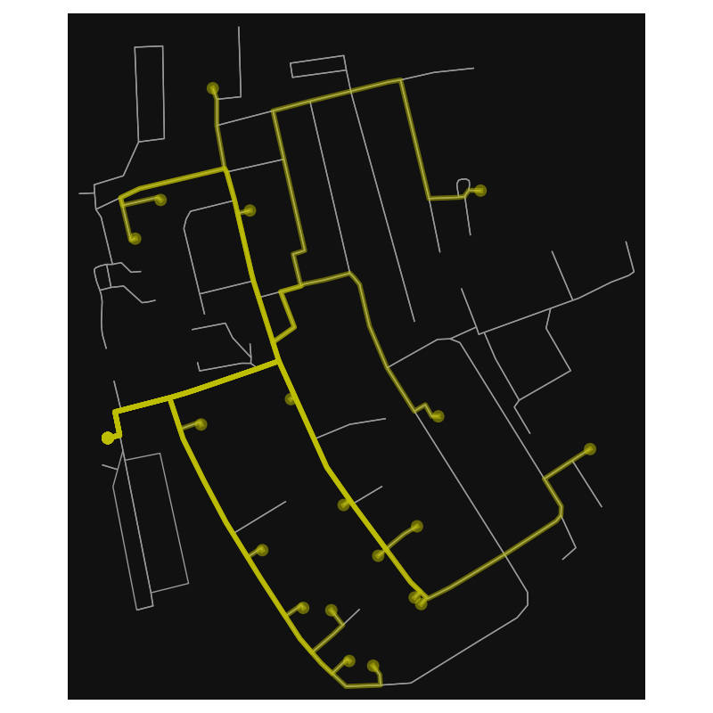
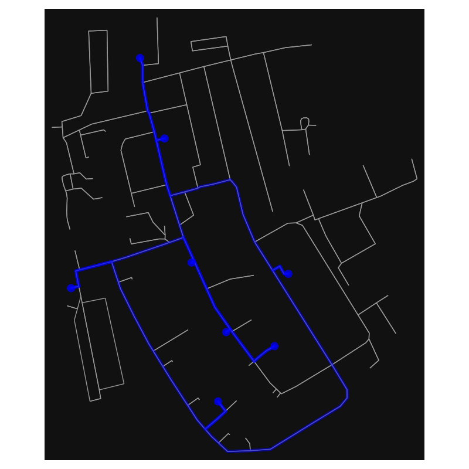

# Machbarkeitsstudie zur Automatisierung des Postdienstes auf dem Gelände der DBI

---

## 1. Planung

### Methodik

**Zu erreichende Ziele:**

* Postverteilung analysieren
* Wege kartieren und kritische Stellen analysieren
* Feedback von Mitarbeitenden sammeln

---

**Angewante Methoden:**

1. Interview mit den Verantwortlichen/Mitarbeitenden:

    * Was ist machbar und in welchem Umfang ist eine Übernahme des Postdienstes erwünscht 

    * Klärung von Rahmenbedingungen für späteres Mapping

    * Ausräumen von Fragen und Unstimmigkeiten

2. Aufnahme von Daten über das Gebiet mittels OSM:

    * Überblick über Ist-Stand erhalten

    * Konkretes Wissen wo Anpassung nötig ist 

    * Planbarkeit für weiteres Vorgehen

## 2. Datensammlung

### Interviews 

**Aktueller Prozess:**

* feste Öffnungszeiten (9:30 Uhr bis 10:15 Uhr) zur Paketabholung und Abgabe
* 25-30 Briefe und 5-25 Pakete pro Monat versendet
* 15-40 Pakete pro Monat angekommen
* größere Paktete meistens direkt an Firmen geliefert
* manche Pakete haben hohe Priorität 

---

**Ursprünglicher Plan:**

* Post wird an Poststelle angenommen und sortiert
* Roboter wird von Hand beladen
* fährt Post autonom zum Ziel
* Angstellter entnimmt Ladung 
* Roboter kehrt zur Poststelle zurück  

---

**Änderungen:**

* Roboter kann nicht von Hand beladen werden (zu Zeitaufwenig)

    * Automatisierte Beladung des Roboters
    * unklar in Umsetztbarkeit 

* Mitarbeiter können nicht auf Roboter warten (ineffizient)

    * Abladeboxen vor jeder Firma nötig 
    * Roboter entlädt Post in jeweilige Box 
    * Automatischer Verschluss (Diebstahlschutz)

---

**Frage der autonomen Lieferbarkeit muss durch OMS Daten erfolgen**

### Dateneingabe in OMS

**Randbedingungen für den Roboter:**

* Befahrbarkeit der Strecke (Qualität der Straße)
* Absätze, Treppen oder andere nicht überfahrbare Hindernisse 
* Abschnitte die nicht befahren werden dürfen
* Gefahr durch andere Verkehrsteilnehmer 
* Erreichbarkeit der Firmeneingänge und Kartierung dieser

---

**Aufgenommene Daten:**

* Genaue Position der Eingänge 
* Zugänglichkeit der Eingängeund eventuelle Hindernisse wie Zäune 

    -> Eintragung dieser Daten in OSM und festhalten durch Bilder

.")

## 3. Datenauswertung

**Auswertung der in OSM eingetragenen Daten mittels bereitgestellten Python Packages**

Erstellung von Grafiken und Karten zur Visalisierung und Auswertung der Probleme.

??[Bild1](../Img/Gewerbepark%20Deutsches%20Brennstoffinstitut.html)

Total distance: 1701.9393416177559 meters without TSP

Total distance: 1483.14 meters 
Travel Time : 14.831437280396823 minutes with TSP 
Optimized TSP Path: [3989756446, 12545926734, 12545926742, 12545926745, 12545926744, 12545926730, 12545926741, 12545926731, 3989756446]

## 5. Resultat

### Haupterkenntnisse

### Fazit

## Vielen Dank für Ihre Aufmerksamkeit!

Haben Sie Fragen?
